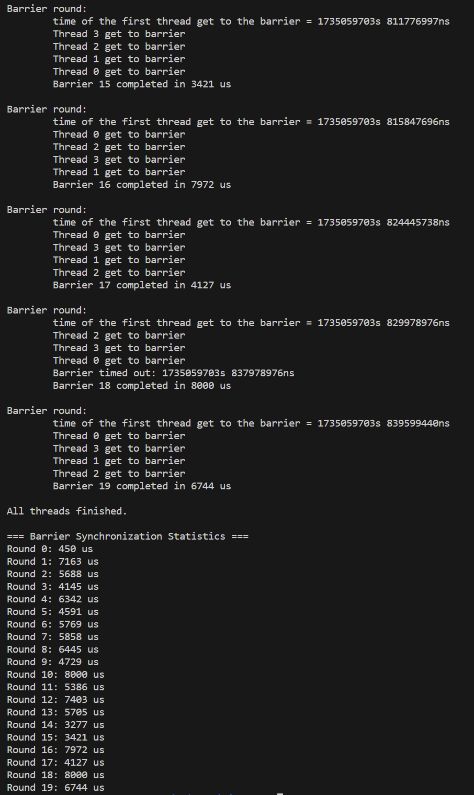

# 项目设计文档：基于屏障同步的线程超时机制实验

#### **项目背景与意义**

多线程编程是现代软件开发中的核心技能之一。在多线程场景中，为了确保线程间的协作，屏障（Barrier）是一种常用的同步机制。屏障的核心作用是在某些关键点阻塞线程，直到所有线程都到达屏障，才能继续执行。然而，在实际应用中，由于线程运行的不确定性（如网络延迟、硬件性能差异），某些线程可能迟迟未到达屏障，从而导致其他线程长时间等待甚至死锁。

在我们小组成员学习本校开展的操作系统课程时，发现缺少多线程编程相关的实践。因此，本实验希望设计一个**带超时机制的屏障同步**实验，让线程在等待一定时间后能够超时退出，避免长时间阻塞，提升系统的健壮性和实时性，培养学生的相关能力。这种机制在需要高性能或高实时性的场景（如并行计算、实时操作系统）中具有重要意义。

------

#### **项目文件说明**

`barrier_empty.c` : 待实现的实验文件

`barrier.c` : 本实验的一个参考实现，（包含测试代码和测试结果）

------

#### **实验思路**

本实验分为以下几部分：

1. **屏障初始化**：
   - 使用 `pthread` 库实现屏障所需的互斥锁和条件变量。
   - 初始化屏障状态（线程数量、轮次计数、等待线程数等），并设置同步统计数据的存储空间。
2. **超时屏障同步机制**：
   - 在屏障中加入超时功能，线程在屏障等待时设定一个超时时间。
   - 如果线程在超时时间内未被唤醒，则超时返回并打印超时信息。
3. **屏障轮次管理**：
   - 通过轮次计数器 `round`，记录线程完成同步的次数。
   - 每轮屏障同步时，记录从轮次开始到结束的总耗时，用于性能分析。
4. **多线程执行与随机延迟**：
   - 模拟多线程并发，随机设置线程延迟以模拟真实环境中的不确定性。
   - 测试屏障在多线程环境中的同步效果。
5. **统计与结果分析**：
   - 每轮屏障同步完成后，记录同步耗时，并输出统计数据，帮助分析同步机制的效率。

------

#### **代码框架说明**

实验代码中已完成的部分包括：

- **屏障初始化与销毁**： 通过 `barrier_init` 和 `barrier_destroy` 函数初始化互斥锁、条件变量，并释放内存资源。
- **线程创建与运行**： 主函数中创建多个线程，并让每个线程执行 `barrier_with_timeout` 函数测试屏障机制。
- **随机延迟**： 模拟线程执行的随机性，为屏障机制的测试增加复杂性。

------

#### **待完成部分说明**

代码中的 `TODO` 部分需要学生完成：

1. **屏障忽略条件**：
   - 需判断某些线程是否需要跳过当前屏障（例如已完成其他任务的线程）。
   - 实现 `if` 条件中的逻辑，确保忽略线程能够直接返回。
2. **超时时间计算与状态更新**：
   - 在每轮屏障开始时，根据当前时间与 `timeout_ms` 计算超时时间。
   - 更新屏障的轮次计数器 `bstate.round`，并记录轮次开始时间。
3. **等待其他线程或超时处理**：
   - 使用 `pthread_cond_timedwait` 等待其他线程到达屏障，或处理超时逻辑。
   - 输出每个线程到达屏障的时间信息；如果超时，输出相关提示信息。
4. **最后一个线程到达屏障的处理**：
   - 负责唤醒所有等待线程，表示当前轮次的屏障同步完成。
   - 记录屏障同步的总耗时，并将耗时存储到 `bstate.sync_times` 数组中。

------

#### **实验步骤**

1. 编译与运行：

   - 按照代码框架填写 `TODO` 部分，确保逻辑正确。

   - 使用以下命令编译和运行代码：

     ```bash
     gcc -o barrier barrier.c -lpthread -Wall -Wextra -O2
     ./barrier <线程数> <超时时间>
     ```

2. 功能测试：

   - 测试屏障同步机制，观察线程到达屏障和超时的输出信息。
   - 验证最后一个线程是否正确唤醒所有线程。

3. 数据分析：

   - 查看每轮屏障的同步耗时统计，分析线程同步机制的性能。

------

#### **运行环境要求**

1. **操作系统**：Linux 环境（推荐 Ubuntu 22.04 或类似版本）。
2. **编译器**：支持 C11 标准的 GCC 编译器（推荐 GCC 9.4 及以上版本）。
3. **工具链：**确保系统安装了以下工具：
   - `gcc`：用于编译 C 代码。
   - `make`（可选）：方便管理编译过程。
   - `gdb`（可选）：用于调试代码。
4. **硬件要求：**
   - 多核 CPU（建议至少 4 核）以测试多线程的实际效果。
   - 最小内存需求：512 MB（测试线程数较多时可能需要更高内存）。

#### **运行方式**

将实验代码保存为 `barrier.c` 文件，并在终端执行以下命令：

```
gcc -o barrier barrier.c -lpthread -Wall -Wextra -O2
```

编译完成后，运行程序：

~~~
./barrier <线程数> <超时时间(ms)>
~~~

#### **实验输出示例**

运行完成后，程序将输出以下内容：

1. 每轮屏障的同步耗时（单位：微秒）。
2. 如果某轮超时，将打印超时信息及所有线程的状态。
3. 最终汇总统计每轮屏障的同步时间，方便进一步分析。

结果示例（`nthread=4，timeout=8ms`）：



#### **本实验锻炼操作系统课学生的能力**

本实验的设计结合了多线程编程和同步机制，实现了对操作系统核心概念的实际运用。在完成实验的过程中，学生可以获得以下能力的提升：

------

##### **1. 理解线程与并发编程的基本原理**

- 学生通过编写代码实际操作线程的创建、运行和销毁，掌握 `pthread` 库的核心函数（如 `pthread_create`、`pthread_join`）。
- 深刻理解线程在共享资源访问时的同步需求，明确线程间协作与竞争的关系。

**对应能力：**

- 掌握线程基本模型。
- 理解操作系统对线程的调度与管理机制。

------

##### **2. 熟悉线程同步机制**

- 屏障（Barrier）是多线程同步的重要工具，学生通过实现带超时机制的屏障，加深对同步工具（如互斥锁和条件变量）的理解。
- 掌握 `pthread_mutex_t` 和 `pthread_cond_t` 的用法，以及在并发环境中如何设计高效的同步机制。

**对应能力：**

- 理解线程同步原语的实现与使用。
- 掌握同步机制的正确性与效率的平衡。

------

##### **3. 理解超时机制与异常处理**

- 学生通过实现超时机制，学习如何处理线程等待超时的场景，这在高实时性系统中尤为重要。
- 掌握条件变量的超时功能（如 `pthread_cond_timedwait`），并设计合理的线程状态更新策略。

**对应能力：**

- 学会在并发系统中处理异常情况（如线程阻塞或超时）。
- 理解操作系统如何在有限资源下平衡实时性与性能。

------

##### **4. 掌握多线程程序的性能分析与优化**

- 通过统计屏障同步的耗时，学生可以分析线程同步机制的性能瓶颈。
- 学生能够设计实验数据结构（如同步耗时数组），并基于实验数据进行优化分析。

**对应能力：**

- 分析并发程序的性能问题。
- 理解操作系统中调度算法对线程同步的影响。

------

##### **5. 学会设计健壮的并发程序**

- 学生需要处理多个线程在屏障处的动态行为，设计逻辑以保证程序的健壮性，避免死锁或数据竞争。
- 学生通过引入轮次计数器等机制，掌握如何在复杂同步场景中维护线程间的正确状态。

**对应能力：**

- 编写高健壮性并发程序，避免常见的并发错误（如死锁、活锁）。
- 理解操作系统中关键同步逻辑的实现方式。

------

##### **6. 实现实验设计和解决问题能力**

- 本实验的 `TODO` 部分提供了一定的自由度，学生需根据问题分析实验目标，并选择合适的实现方式。
- 通过设计超时机制和屏障逻辑，学生提升了独立解决问题和实现复杂逻辑的能力。

**对应能力：**

- 分析需求并设计实现方案。
- 理解操作系统中复杂功能模块的设计与实现。

------

##### **7. 理解线程调度与并发行为**

- 学生通过模拟多线程延迟场景，观察线程到达屏障的动态行为，学习并发程序中调度的影响。
- 理解操作系统中线程调度策略对线程运行顺序和性能的影响。

**对应能力：**

- 理解线程在操作系统中的调度规则。
- 掌握线程延迟、超时等异常情况下的同步处理策略。

------

##### **8. 提升调试与问题排查能力**

- 本实验涉及多个线程的交互与同步，学生需要通过打印日志、观察屏障输出等方式定位问题。
- 学生通过调试练习，掌握并发程序中常见问题的排查方法（如死锁、超时处理不当）。

**对应能力：**

- 提升并发程序的调试能力。
- 学会借助工具与日志定位问题。

------

#### **改进点**

本实验虽然设计精巧，能够全面锻炼学生的线程同步与并发编程能力，但仍有一些可以改进的地方。

首先，实验目前对屏障的轮次和线程数的约束较为固定，学生可能难以自由扩展测试场景。可以通过增加配置选项，让学生能够自定义屏障的最大轮次和线程数，甚至支持动态调整线程行为，以模拟更复杂的并发环境。其次，超时机制的作用仅限于打印超时日志，没有实际处理超时线程的逻辑，例如将超时线程从屏障中剔除或者设置恢复机制。这种改进能够帮助学生更深入理解异常线程的管理和恢复策略。

另外，可以考虑将本实验设计为实现xv6操作系统的一个系统调用，可以同时考察和锻炼学生创建系统调用的能力，使本项目和本校操作系统课程的一系列基于xv6的lab结合得更加紧密。

最后，实验对学生的指导可以更细致。对于屏障的设计与实现逻辑，可以提供更清晰的分步引导，帮助学生快速理解任务要求。同时增加错误示例或常见问题说明，能让学生在调试时更容易定位问题并提高解决效率。通过这些改进，实验不仅可以更具挑战性，还能为学生提供更贴近真实操作系统场景的实践体验。